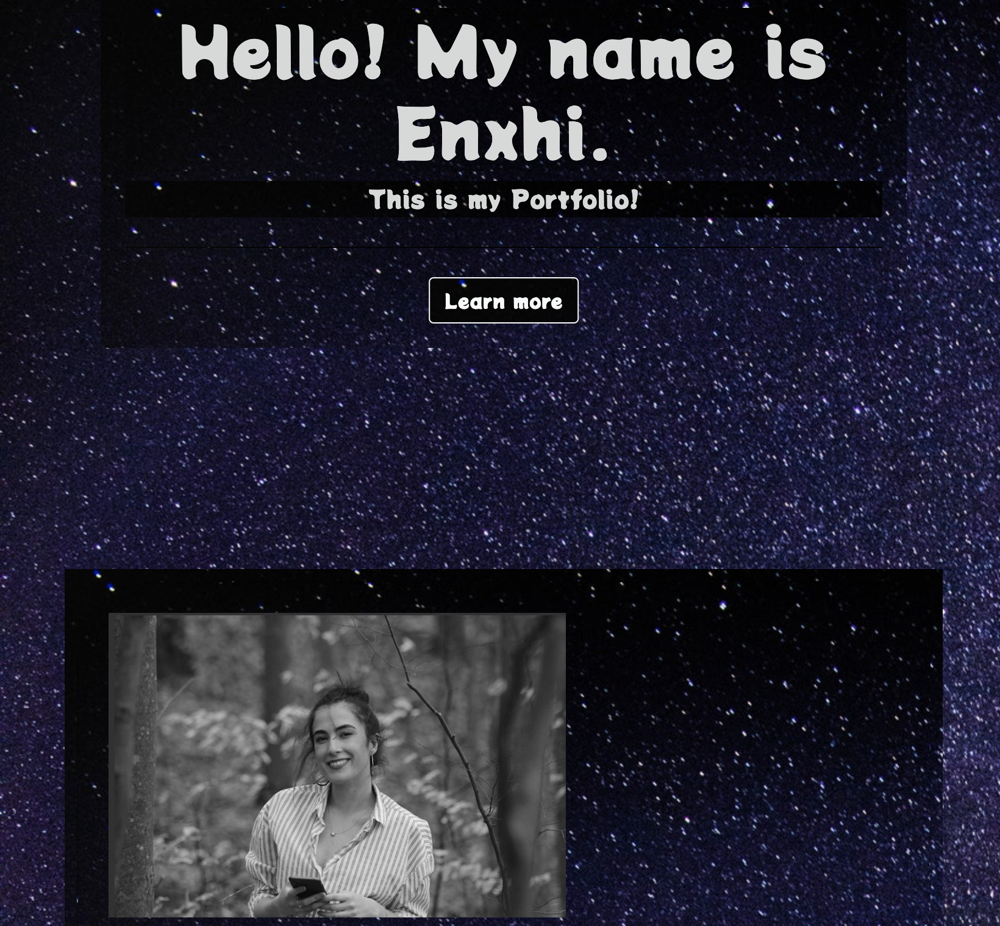

# Portfolio

## Description
This is a portfolio website, where is included a short biography accompanied with a resume. In the website is included education and some projects and assignments. Additionally, a get in touch section. In the footer is included my LinkedIn, my GitHub and email.

## Table of Content
1.  [Technology](#technology)
2.  [Image](#image)
3.  [Links](#links)
4.  [Contribution](#contribution)
5.  [Questions](#questions)

## Technology
  This portfolio was built with:
  * HTML
  * CSS
  * Bootstrap 
  * Boot-snippet 
  * jQuery
  * JavaScript
  * Font-Awesome
  * Google-Fonts
  * ColorHunt
  * Adobe Color

## Image

## Links
  * Deployed link in GitHub Pages: https://enxhis.github.io/Portfolio/
  * GitHub repository link:        https://github.com/Enxhis/Portfolio

## Contribution
  * Enxhi Salaj

## Questions
  * If you have questions, email me at: enxhi_salaj@yahoo.com,
  * GitHub Profile link: https://github.com/Enxhis
